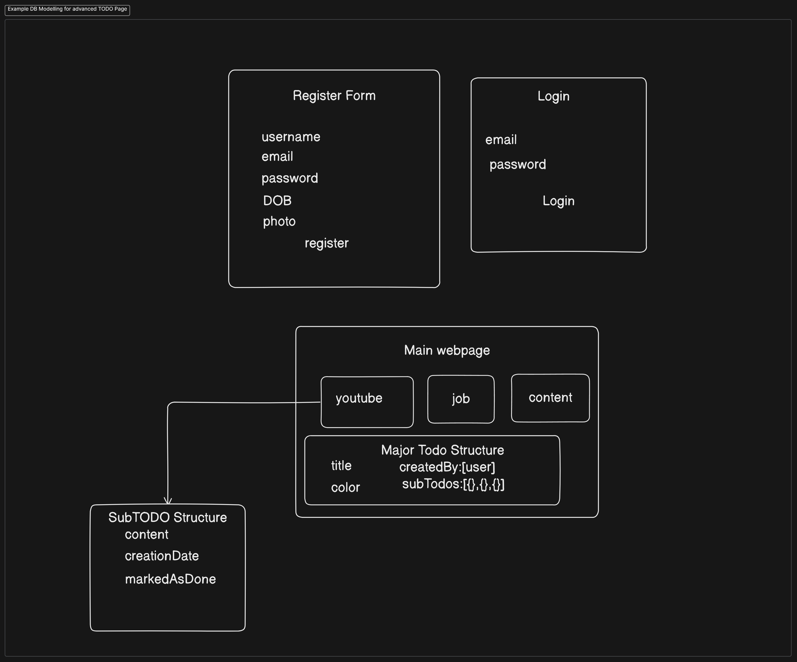

# Mongoose

## Data Modelling tools:

- Use `eraser.io`- for us (free).
- Use `MOON MODELER` for data modelling - used by enterprises.
- Use pen and paper if all of them not available.

### Sample Data Model - Advanced TODO Modelling



### Basic template for every models file:

- make directory in root named `models` and name files as `name.models.js`.
- _Starter template of every model file:_

```javascript
import mongoose from "mongoose";

const userSchema = new mongoose.Schema({});

export const User = mongoose.model("User", userSchema);

// NOTE: database me jaate hi model prural me covert ho jaata hai aur lowercase me- idhar users ban jaayega database
```
