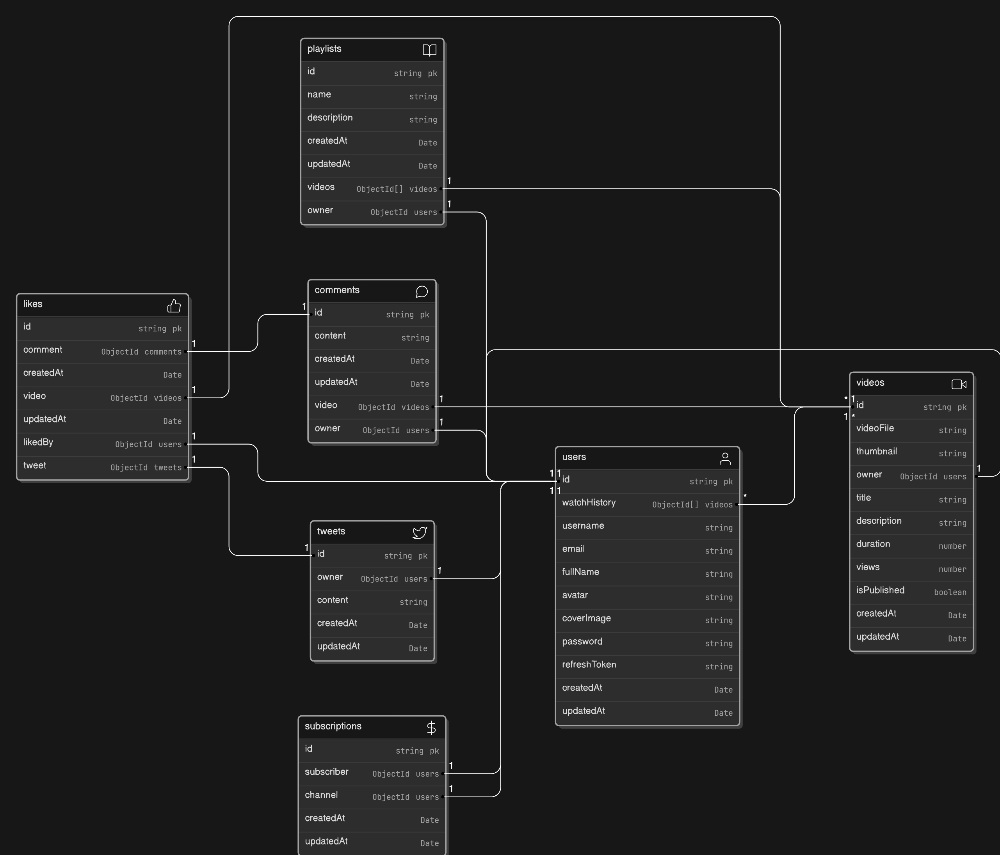
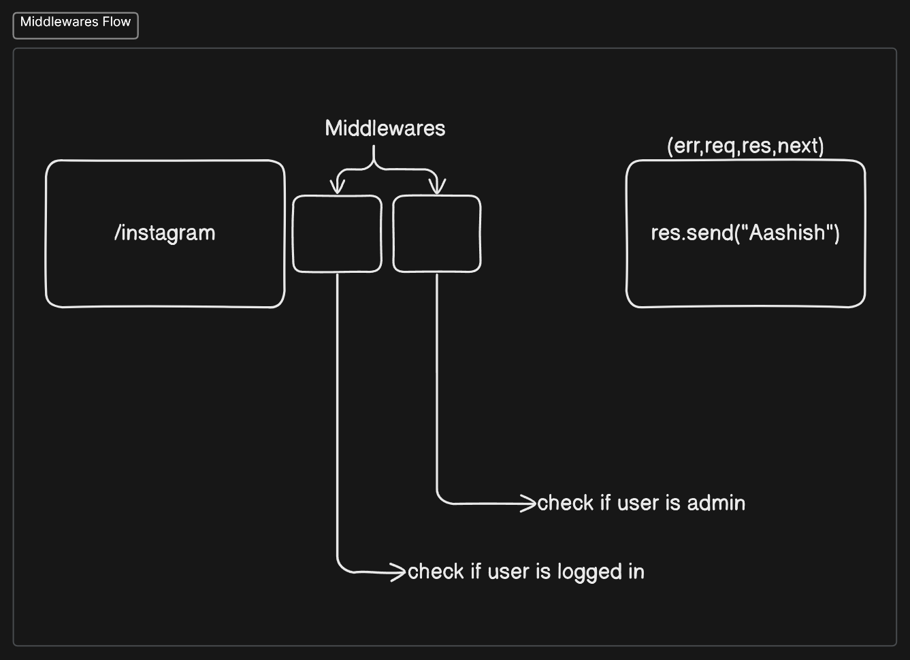
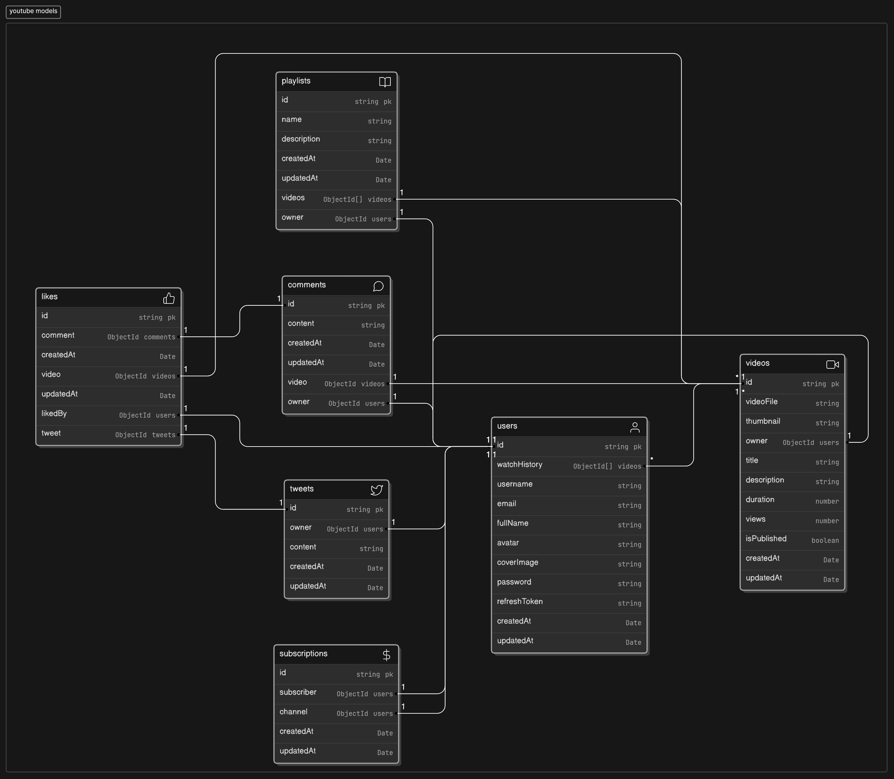

# About the project

## Model

Link: `https://app.eraser.io/workspace/MNhSwtDPULdXRieinIOW?origin=share&elements=4XZUDlBO-tE3usVfPzbo5Q`

## Middleware flow

## Models used:

Link:`https://app.eraser.io/workspace/bj3e4jpKoAzQfcO5B0gT?origin=share&elements=COHbNlvIfT3JIngDTw1GhQ`

### npm packages used in models:
- *mongoose-aggregate-paginate* : Helps in pagination 
- *jsonwebtoken(jwt)* (cookies)
- *bcrypt* : for hashing